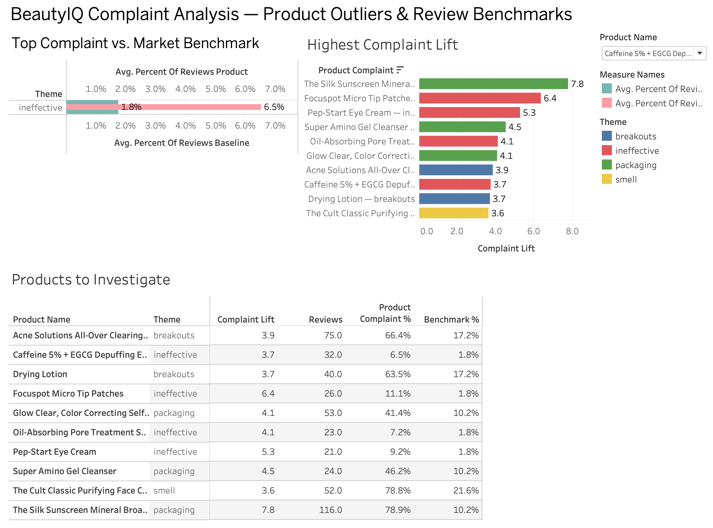

# BeautyIQ

BeautyIQ is an interactive beauty product analytics dashboard designed to analyze product data and customer reviews to identify consumer preferences, recurring complaints, and potential product opportunities.

## Tech Stack

- Python
- pandas
- SQL / SQLite
- Streamlit
- OpenAI API
- Tableau
- Jupyter Notebook
- Git / GitHub

## AI-Powered Review Insights

BeautyIQ includes an AI-assisted review analysis feature built with the OpenAI API.

For a selected product, the dashboard samples low-rated customer reviews and uses an LLM to synthesize:

- recurring customer complaints
- positive themes still mentioned by dissatisfied customers
- the primary driver of dissatisfaction
- an actionable product improvement recommendation

This AI layer complements the dashboard's quantitative complaint analysis by helping translate unstructured review text into concise business insights.

## Tableau Dashboard

To complement the Streamlit application, I built a Tableau dashboard focused on product-level complaint benchmarking and outlier detection.

The dashboard includes:
- Product complaint rate vs. market benchmark
- Top 10 product-theme combinations by complaint lift
- Products-to-investigate table with complaint theme, lift, review count, product complaint rate, and benchmark rate

This view is designed to help a beauty brand quickly identify products with unusually elevated customer complaints and prioritize areas for product improvement.

## Status

Functional MVP complete; additional polish and feature improvements are ongoing.
